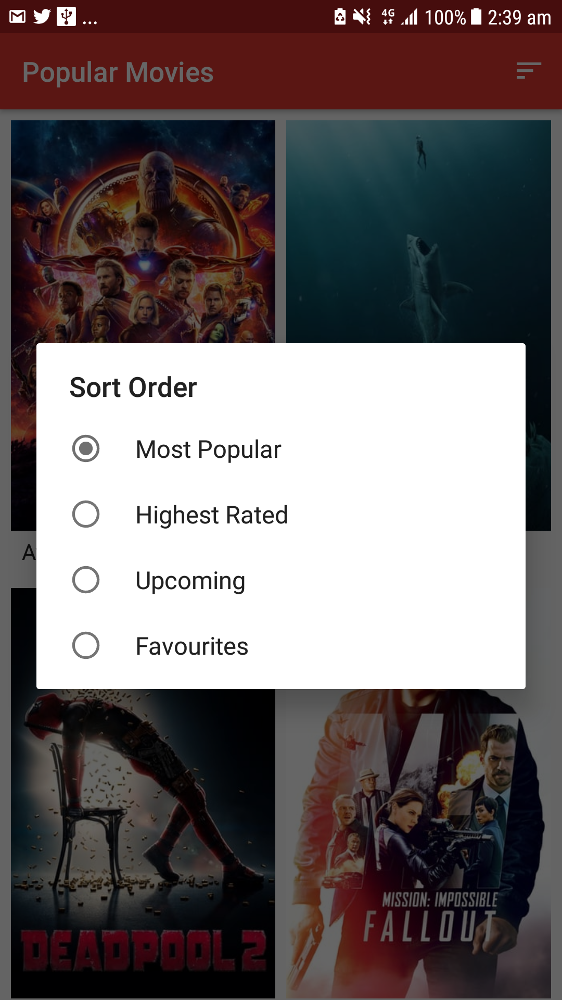
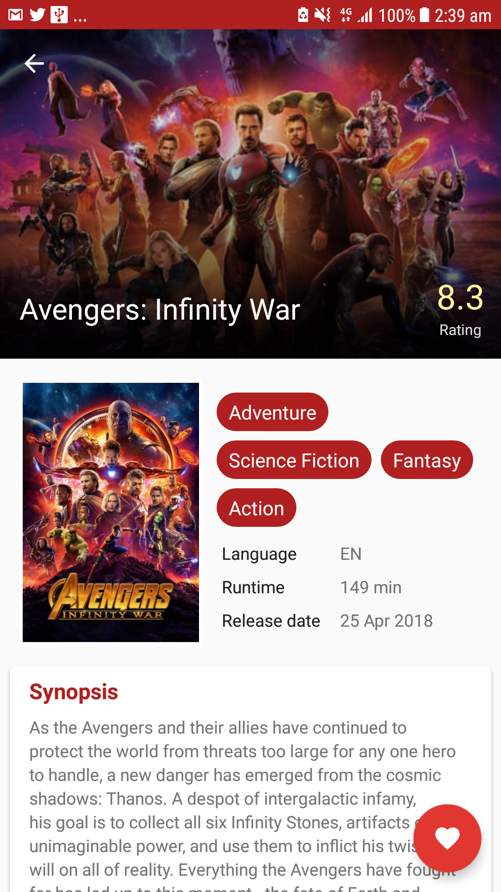

# Popular Movies App
**Popular Movies** app written for Udacity Android Developer Nanodegree Program

## Table of Contents
* [Project Background](#project-background)
* [Requirements](#requirements)
* [Getting Started](#getting-started)
* [Project Screenshot](#project-screenshot)
* [Bugs and Feature Requests](#bugs-and-feature-requests)

## Project Background
 The app shows the most popular movies playing. Details of each movie is displayed when user tap on a movie poster. The movies are sorted either by most popular or highest-rated.

## Requirements
- Android Studio 3.1.3
- Build Tools Version 27.1.0
- Minimum Android Version: 15

## Getting Started
To run the app, please login to [TheMovieDB website](https://developers.themoviedb.org/3/getting-started/introduction) and request an API key. Replace the text "[YOUR_API_KEY]" with your API key in "NetworkUtils" file. Then build and run the file in your mobile device or emulator.

## Project Screenshot
Home screen. Movies list are sorted either by most popular or highest-rated.

    
    

Detail screen

    

## Bugs and Feature Requests
If there is a bug or feature request, please open an [issue](https://github.com/eileenwong9305/Popular-Movies/compare/new).
